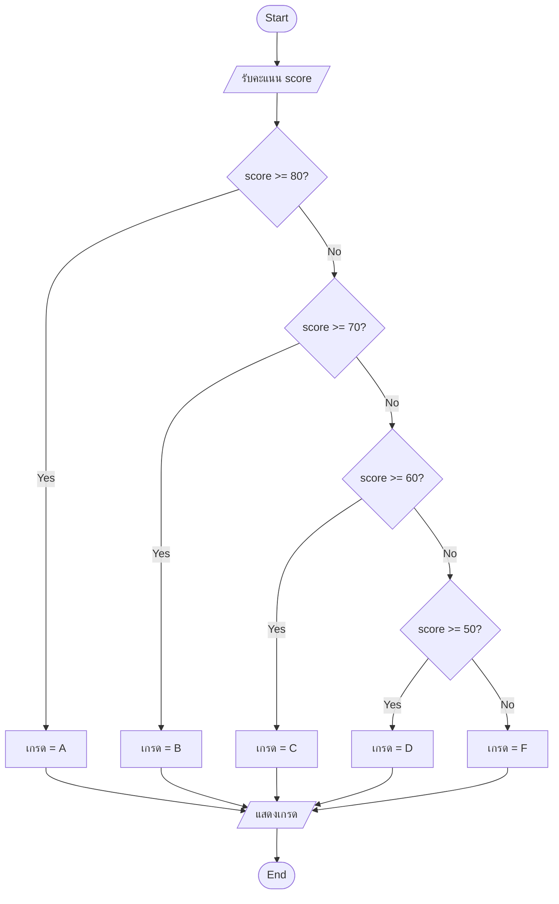
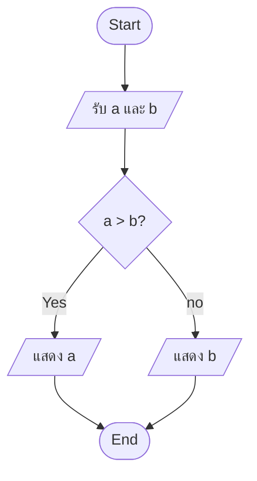
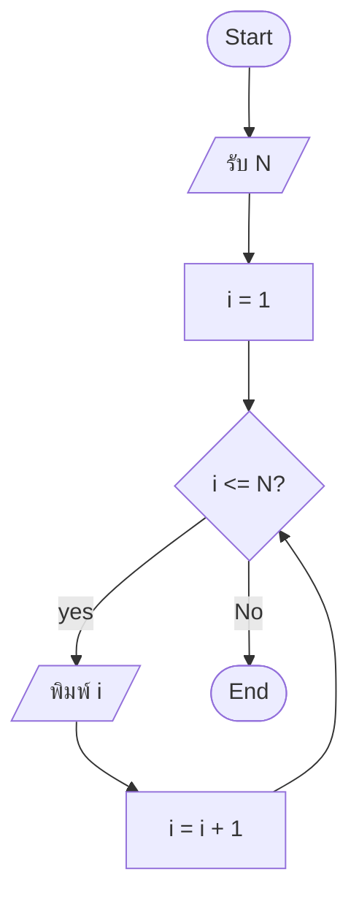

```mermaid
flowchart TD
Start([Start]) --> Input[/รับคะแนน score/]
Input --> D1{score >= 80?}
D1 -->|Yes| A[เกรด = A]
D1 -->|No| D2{score >= 70?}
D2 -->|Yes| B[เกรด = B]
D2 -->|No| D3{score >= 60?}
D3 -->|Yes| C[เกรด = C]
D3 -->|No| D4{score >= 50?}
D4 -->|Yes| D[เกรด = D]
D4 -->|No| F[เกรด = F]
A & B & C & D & F --> Output[/แสดงเกรด/]
Output --> End([End])
```

```mermaid
flowchart TD
A([Start]) --> Input[/รับ a และ b/] 
 Input--> D{ a > b? }
D -->|Yes| a[/แสดง a /]
D -->|no| b[/แสดง b /]
a & b -->
B([End])
```

```mermaid
flowchart TD
A([Start]) --> input[/รับ N /]
input --> a[i = 1] 
--> b{i <= N?}
b --> |yes| b1[/พิมพ์ i/]
b --> |No| B([End])
b1 --> b2[i = i + 1] --> b
```
